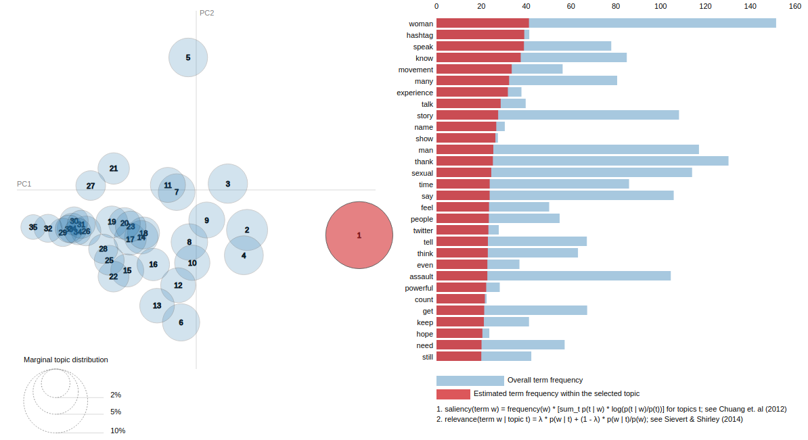
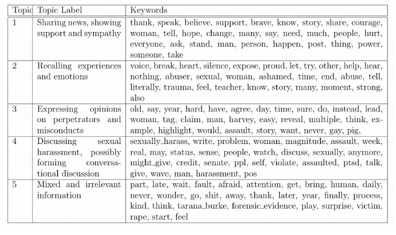
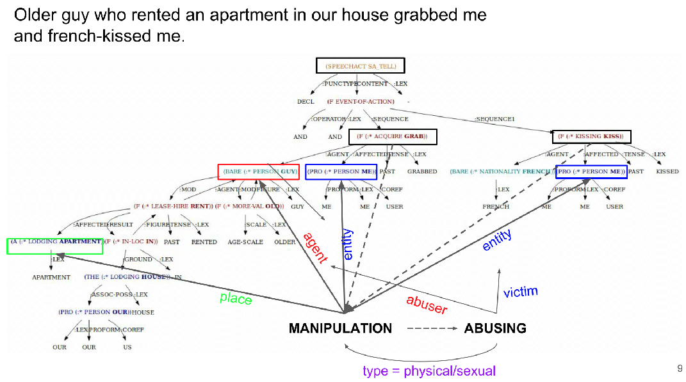
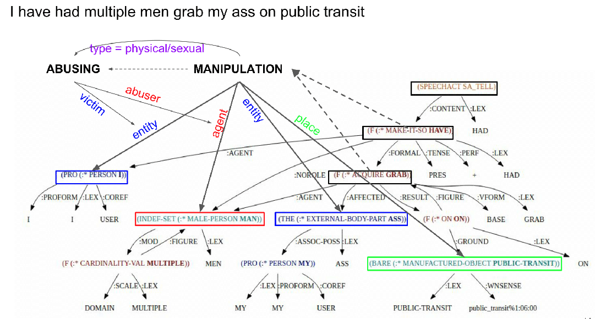
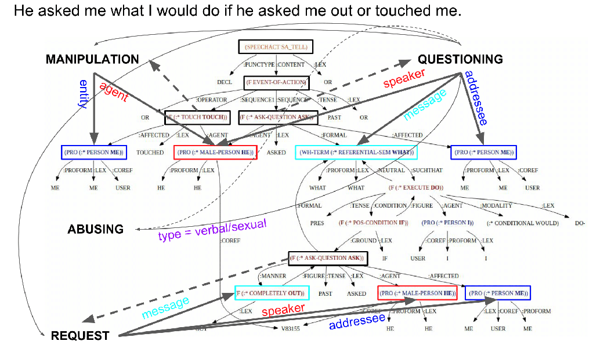

## Problem statement
According to National Sexual Violence Resource Center (NSRVC), one in five women and one in sixteen men are sexually assaulted while they are attending college. Current studies on college sexual misconduct usually collect data based on questionnaires from a small sample of the college population, which might not be sufficiently substantial to capture the big picture of sexual harassment risk of the entire student body. Alternatively, social media opens up new opportunities to gather a larger and more comprehensive amount of data and mitigate the risk of false narratives from the studied subjects.

## Motivation
The emergence of the \#MeToo trend on social media has empowered thousands of people to share their own sexual harassment experiences. We expect to be able to extract the underlying the implications of \#MeToo naratives, with respect to their general topical themes and semantic meanings, analyze their influence in raising public awareness and highlight the severity of sexual harassment toward the members of the college community.

## Related Work
The ubiquity of social media has motivated various research on widely-debated social topics such as drug use, hate code, or presidential election using Twitter data. Recently, Manikonda et al. (2018) took the earliest steps to understand sexual harassment using social media. The research uses \#Metoo tweets from Twitter and Reddit using topic modeling and sentiment analysis to distinguish the difference in the purposes of the \#MeToo tweets posted on Twitter and Reddit. However, most techniques deployed so far have relied solely on quantitive methods based on probabilistic theory, which do not consider meaning explicitly and require significant amount of data.

Work has also been on knowledge-driven event extraction and building automatic semantic parsers that can extract patterns from texts with domain knowledge. Researches which are relevant to our study typically deal with extracting events from newswire, broadcast transcripts, and internet weblogs, prominently using frame semantics. In addition, Søgaard et al. (2015) used SEMAFOR, a state-of-the-art automatic frame parser, to extract entity-type relations from Twitter, which produced promising results comparing to newswire and Wikipedia data. This gives us confidence to experiment this approach on our dataset.

## Methodology
### LDA Topic Modelling
Due to the noisy lexical and structural contents of the text data, we need to determine topical clusters of the \#MeToo tweets and focus our efforts on the most informative ones. Latent Dirichlet Allocation(LDA) is a generative probabilistic model of a collection of sentences made up of words which consists of two matrices, the first is the probabilities selecting a particular topic when sampling  a  particular  sentence, and the  second is probabilities of particular words within topics. We fine-tune the parameters and apply LDA on the whole dataset to obtain a new dataset consiting of 35 clusters of texts. The clustering performance are shown below.

### Semantic Parsing with TRIPS and Pattern Recognition
The target of this approach is to verify results of the last experiment, as well as gaining more insights on sexual harassment events via semantic parsing and event extraction. 

From the keywords extracted from the most prominent clusters, we can observe that the second cluster contains words that are related to the storyteller's sexual harassment experiences. We feed the tweets from this cluster to the TRIPS parser to obtain the Logical Form (LF) tree and manually identify relationships between events and their arguments. The majority of the tweets mentions a SA_TELL speech act which describes an event, typically EVENT-OF-ACTION. The AFFECTED role is usually ME and and AGENT role is usually a non-ME PERSON, and the appearance of verbs such as TOUCH, KISS, GRAB indicates physical contact or manipulation (examples 1 & 2). Verbal abuse is also present in the form of provocative QUESTIONING or REQUEST (example 3), which is often parsed incorrectly due to syntactic compexity, but easily recognized by human interpreter.

### Frame Semantics
However, the patterns obseved in the TRIPS LFs are too simple, and the patterns constructed with grammatical semantics without various and specific domain knowledge on sexual harassment would fail miserably in capturing information that varies greatly in terms of lexical and argument complexity as in tweets. This task is much more achievable using frame semantics, with crowd-sourced knowledge from FrameNet and a state-of-the-art parser such as SEMAFOR, which has been successfully proven to have satisfactory performance on noisy text data such as newswire, broadcast transcripts, internet weblogs, crowd-sourced enclopedia and most importantly, social media.

### Training SEMAFOR
For training an automatic parser tailored for dataset on sexual harassments, we need to obtain gold frame annotations for the tweets. Since FramNet has a fairly well-define set of frames with appropriate arguments and lexical units that evoked them, annotators using FrameNet Search tool and careful examination of the arguments can genrally produce a admissible dataset. Some parsed examples are shown on top of the TRIPS LF trees below.

The general framework of SEMAFOR consists of three tasks: trigger classification, frame classification and argu classification. The first task identifies the trigger words (lexical units) that can evoke frames within a sentence. Then the appropriate frames are predicted using a log-linear function of the trigger words. Afterwards, arguments for the frame are predicted to obtain the parsed results, using a log-linear functions of the argument words indentified by a dependency parser.

If our parser works out well enough, we can potentially do inferences like MANIPULATION => ABUSING with type physical/sexual, which could be used to detect sexual harassment events in tweets since the ABUSING event are often not explicitly stated.

### Knowledge Transfer from Frame Semantics to TRIPS
Although frame semantics is sufficient for event extraction in our Twitter, the TRIPS LF has better language understanding capability since it captures meanings by grammars and semantic structures. Thus, if we can transfer the knowledge obtained from frame semantics regarding the event-argument relationships to TRIPS-type relations, we might be able to extract linguistic patterns from the tweets just as well as frame semantics, while inventing a more general approach with knowledge defined from semantics that can be extended to studies on other topics.

## Additional notes
Outline of plans for #metoo paper until submission: (possibly until the end of April)
- Write descriptions for dataset, with example frame annotated examples (done shortly)
- Obtain gold annotations for tweets in FrameNet frame semantics (1-2 weeks)
- Implement and test SEMAFOR on the gold set, fix bugs and add necessary extensions (1 for implementing the system, 1-2 more weeks for experimenting depending on the progress of annotating)
- Find ways to represent the frame patterns in TRIPS patterns (1 week)
- Come up with meaningful analysis of the discovered information (1 week)
- Write paper (3-4 days)
